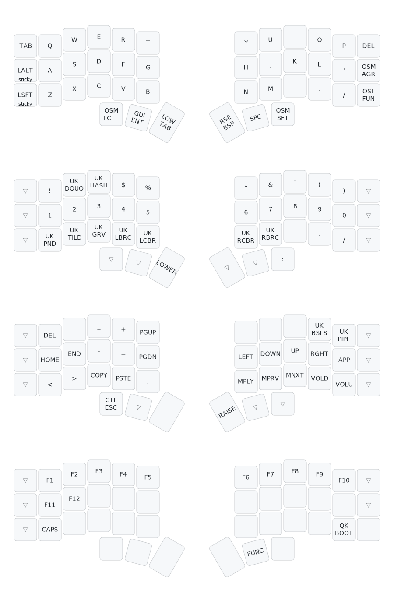

# Vince's Corne keyboard layout

This is heavily influenced by markstos Corne layout, with adjustments to suit a UK keyboard layout.

A primarily 3x5 layout for split ergonomic keywords with a extra column on each hand for rare and optional keys.

For a detailed description and keymap design choices see [markstos Corne layout article](https://mark.stosberg.com/markstos-corne-3x5-1-keyboard-layout).

# Installation

qmk compile -kb crkbd/rev1 -km vince-corne

# Disclaimer

This is my personal layout and is subject to evolve further with my tastes.

# Image

